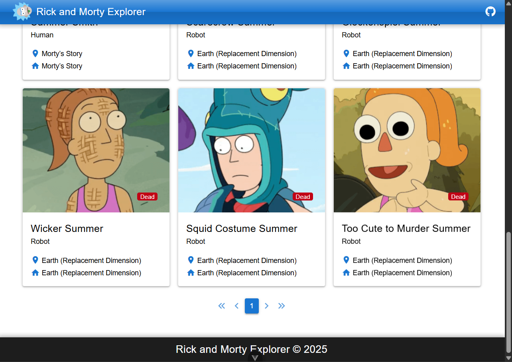
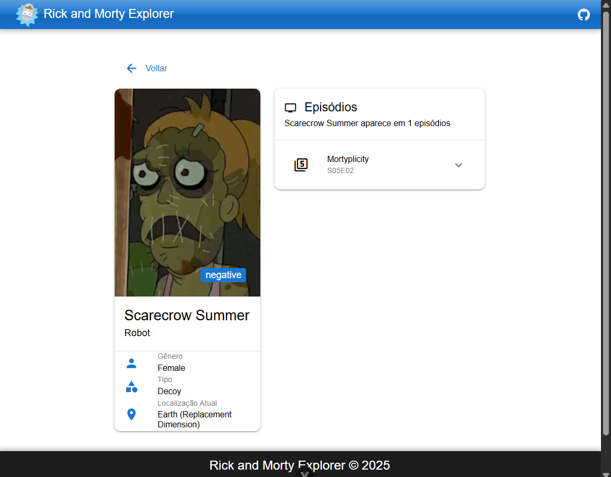

# Rick and Morty Explorer

Este projeto é uma aplicação web que consome a API GraphQL da série Rick and Morty para exibir informações sobre personagens e episódios.

Veja online em [quasar-rickandmorty-app.netlify.app](https://quasar-rickandmorty-app.netlify.app/)

## Tecnologias utilizadas

- Vue 3
- TypeScript
- Quasar Framework
- Apollo Client (GraphQL)
- Vite

## Funcionalidades

- Listagem de personagens com paginação
- Filtro de personagens por nome
- Página de detalhes do personagem
- Visualização dos episódios em que o personagem aparece

## Como executar o projeto

1. Clone o repositório

```
git clone https://github.com/pedro2s/rick-morty-app.git
cd rick-morty-app
```

2. Instale as dependências

```
npm install
```

3. Execute o projeto em modo de desenvolvimento

```
npm run dev
```

4. Acesse a aplicação em `http://localhost:5173`

## Como construir para produção

```
npm run build
```

## Estrutura do projeto

- `/src/components`: Componentes Vue reutilizáveis
- `/src/views`: Páginas da aplicação
- `/src/composables`: Hooks personalizados
- `/src/graphql`: Queries e mutations GraphQL
- `/src/types`: Tipos TypeScript
- `/src/router`: Configuração de rotas
- `/src/assets`: Arquivos estáticos

## API

A aplicação consome a API GraphQL do Rick and Morty disponível em: https://rickandmortyapi.com/graphql

## Screenshots

### Página de Listagem



### Página de Detalhes



## Recursos adicionais

- Interface responsiva (funciona em dispositivos móveis e desktop)
- Animações e transições para melhor experiência do usuário
- Estilização com tema baseado nas cores da série
- Navegação otimizada entre páginas

## Possíveis melhorias futuras

- Adicionar mais filtros (status, espécie, gênero)
- Implementar modo escuro
- Adicionar seção de localizações
- Melhorar a acessibilidade
- Implementar testes unitários e E2E

## Licença

MIT
